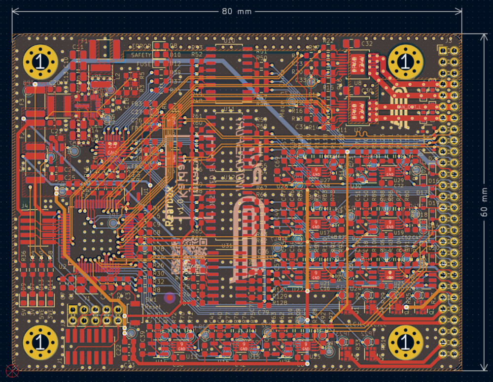
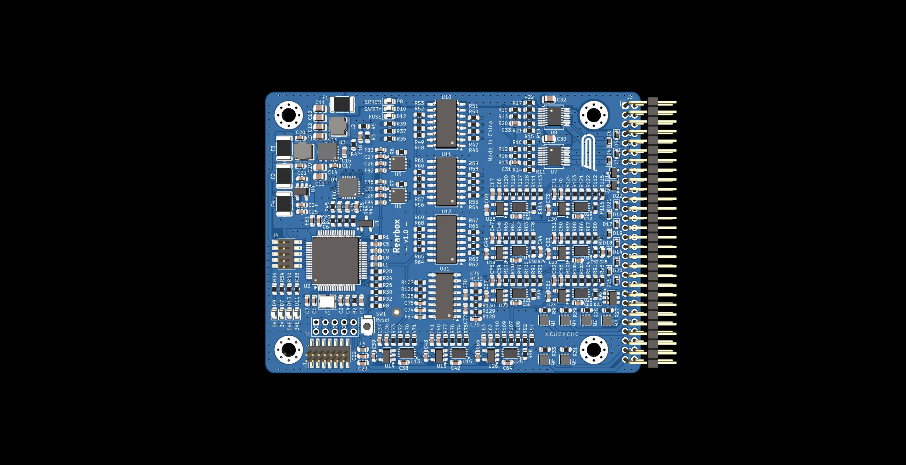
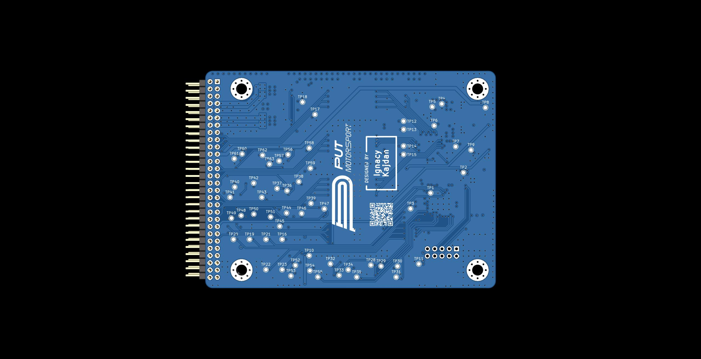

# Rearbox

This PCB integrates all rear-side vehicle electronics, handling communication, power outputs, and sensor inputs in a compact form factor.

<br>
<div align="center">
  </img>
  <br><br>
  <em>PCB layout.</em>
</div>
<br>

## Communication Interfaces

* **2× CAN transceivers** (external)
* **UART**, **SPI**, **I2C** (internal only)

## Power Outputs

* 2× fan drivers
* 2× pump drivers
* ASSI driver
* RTDS driver
* Brake light driver

## Sensor & Signal Inputs

* 12× digital safety inputs
* 2× suspension load cell sensors
* 2× suspension potentiometers
* 2× water pressure sensors
* 2× water temperature sensors
* Monocoque temperature sensors

## Overview

<br>
<div align="center">
  
&nbsp; &nbsp; &nbsp; &nbsp;
  
  <br><br>
  <em>Front and back view of the PCB.</em>
</div>
<br>


## Firmware

> [!IMPORTANT]
> For the CAN library to work correctly, the auto-generated HAL driver file needs to be patched.
>
> Make sure to restore any changes made by the generator to the `firmware/Drivers/STM32G4xx_HAL_Driver/Src/stm32g4xx_hal_fdcan.c` file or the receiving won't work!

Below are the changes that need to be made to the `stm32g4xx_hal_fdcan.c` file:

```diff
2231c2231
<     assert_param(IS_FDCAN_RX_FIFO(RxLocation));
---
>     //assert_param(IS_FDCAN_RX_FIFO(RxLocation));
2235c2235
<         if(RxLocation == FDCAN_RX_FIFO0) /* Rx element is assigned to the Rx FIFO 0 */
---
>         if(RxLocation == 0) /* Rx element is assigned to the Rx FIFO 0 */
2343c2343
<         if(RxLocation == FDCAN_RX_FIFO0) /* Rx element is assigned to the Rx FIFO 0 */
---
>         if(RxLocation == 0) /* Rx element is assigned to the Rx FIFO 0 */
```

## License

This project is licensed under the GPLv3 License. See the [LICENSE](LICENSE.md) file for details.
